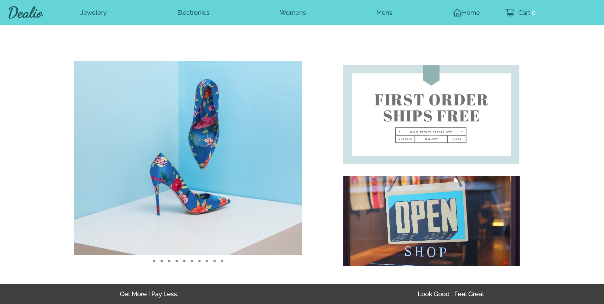

# TechCation

## Deployed Website
[Dealio](https://dealio.vercel.app/)  
Initial Deployment Date: April 4, 2023

## Description
I have built a fully-functional e-commerce site using Next.js, Tailwind CSS, MongoDB, and Stripe. This project allowed me to showcase my expertise in these modern technologies and tools. With Next.js, I was able to create a fast and responsive frontend with support for server-side rendering and code splitting. I used Tailwind CSS to quickly style the elements, while MongoDB provided a flexible and scalable backend database. Finally, I integrated Stripe into the site using webhooks, allowing me to securely process payments online. Overall, I am proud of the work that I have done on this e-commerce project and I am excited to see it grow and evolve over time.

## Tech Used
- NextJS
- Tailwind
- MongoDB
- Stripe

## Prototype

## Questions
Feel free to contact any contributing developer with suggestions for improvements, questions or concerns.
 
[Email: Aaron Anglin](mailto:aaron.anglin101@gmail.com)

## Contributor
<td align="center"><a href="https://github.com/aanglin"> <b>Aaron Anglin</b></a></td>